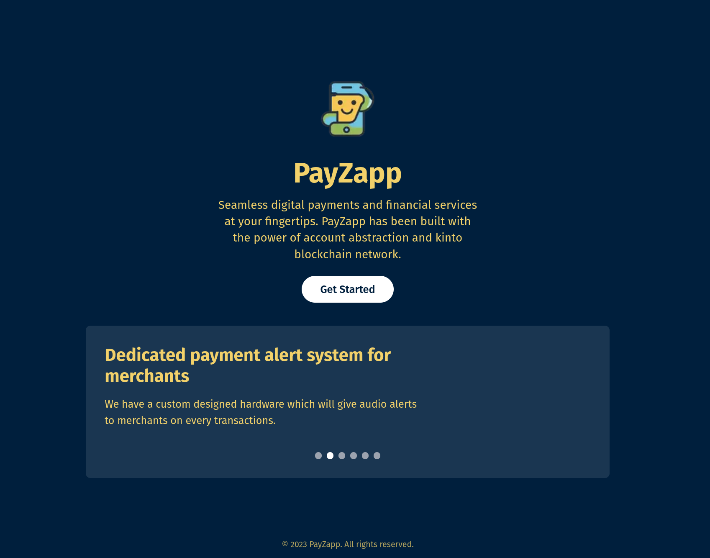

# 💸 PayZapp
<!-- 🏗 -->
<h4 align="center">
  <a href="https://payzapp-ogaur1aa3-sandyagus-projects.vercel.app">Website</a>
</h4>

🧪 *PayZapp* is a web3 onboarding solution that simplifies crypto adoption by linking blockchain wallets to **phone numbers or email addresses**. PayZapp bridges traditional and blockchain finance making crypto more accessible and useful in everyday life.

⚙️ Built using **Kinto, XMTP Protocol, Sign Protocol**.
⚙️ Built using NextJS, Supabase, Viem, and Typescript.


## 🧱Quickstart 

To run PayZapp, follow the steps below:

1. Clone this repo & install dependencies

```
git clone https://github.com/sandyagur8/payzapp.git
cd payzapp
```

2. Run a local network in the first terminal:

```
yarn dev:https
```


## 🔥 About PayZapp 

PayZapp provides he following features:

- 📱   Web3 onboarding solution linking crypto wallets to phone/email.
- 🔔 Allows merchant to present their offers to subscribers.
- 💸 Financial services: Loans and Offline transactions via SMS
- 📢 Hardware component for real-time transaction notifications
- ⭐ Platform to Review merchants


## ⚙️ Protocols Used 

- **Kinto**: Built on Kinto blockchain. We provide no collateral loans to wallets that have completed *KYC on kinto bloackchain*. 
- **XMTP**:  Offers published by the merchants are pushed as notifcations to the subscribed users using XMTP.
- **Sign Protocol**: Reviews published by the users are attested using the sign protocol.


## 👀Sneak Peeks 

### **Landing Page:**


### **Merchant Dashboard:**


### **User Dashboard:**


### Note:

Merchants might need to run dedicated XMTP server for proper functioning


